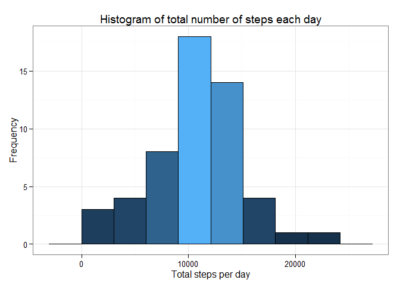
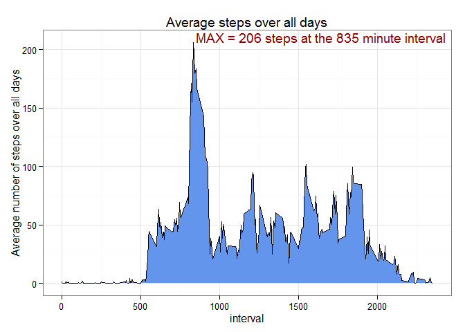
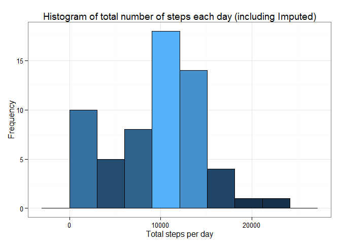
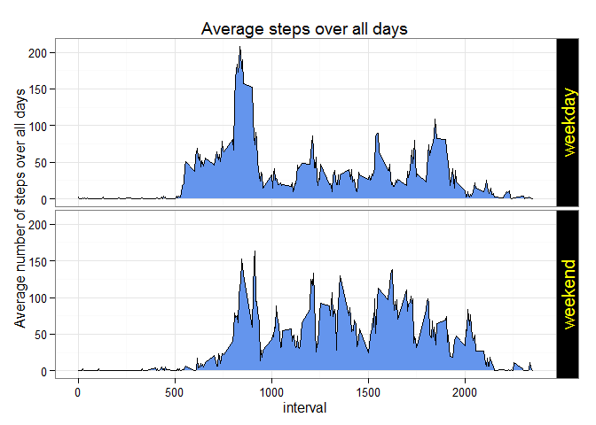

# Reproducible Research: Peer Assessment 1


## Loading and preprocessing the data
The zipped csv file is first loaded with the columns defined as:

* steps - type 'numeric'
* date - type 'Date'
* interval - type 'numeric'


```r
rm(list=ls())
setwd('H:/Courses/DataScience/ReproducibleResearch/Assignment1/RepData_PeerAssessment1')
fileName = 'activity.zip'
data <- read.csv(unz(fileName, "activity.csv"),colClasses = c('numeric','Date','numeric'))
```
The data loaded has the following format


```r
library(pander)
pander(data[seq(1,dim(data)[1],length.out = 6),],style='rmarkdown')
```


|   &nbsp;    |  steps  |    date    |  interval  |
|:-----------:|:-------:|:----------:|:----------:|
|    **1**    |   NA    | 2012-10-01 |     0      |
|  **3514**   |    9    | 2012-10-13 |    445     |
|  **7027**   |    0    | 2012-10-25 |    930     |
|  **10541**  |    0    | 2012-11-06 |    1420    |
|  **14054**  |   177   | 2012-11-18 |    1905    |
|  **17568**  |   NA    | 2012-11-30 |    2355    |

As can be seen there are *NA* values present. The effects of excluding and imputing the missing values will be explored in the course of this document.

## What is the average total number of steps taken per day?

For this part of the assignment, **the missing values in the dataset will be ignored**. A histogram of the total number of steps taken each day will be shown. The average and median of the total number of steps taken per day will be reported.


```r
require(dplyr)
require(ggplot2)

# Steps: filter by excluding NA values, then group by date and sum each date by summarising
stepsByDate=filter(data,!is.na(steps)) %>% select(-interval) %>% group_by(date)
totalStepsByDate=summarise(stepsByDate,totalSteps=sum(steps))
summaryStats=summarise(totalStepsByDate,MEAN=mean(totalSteps),MEDIAN=median(totalSteps))

# Set the bin width of the histogram so we avoid 'gaps'
binw=diff(range(totalStepsByDate$totalSteps))/7

# And plot
g <- ggplot(data=totalStepsByDate,aes(x=totalSteps,fill=..count..))
g+scale_fill_gradient(guide='none')+
        theme_bw()+
        xlab('Total steps per day')+
        ylab('Frequency')+
        ggtitle('Histogram of total number of steps each day')+
        geom_histogram(binwidth=binw, colour='black')
```


Some summary statistics:

* The **average** total number of steps every day is **10766**.
* The **median** total number of steps every day is **10765**.

> Note that the average and median in this case is very close to each other. This result, however,
> depends on no assumptions around missing data - *NA* points will simply not be considered. Later on 
> the impact on the distribution, when missing values are imputed, will be considered.

## What is the average daily activity pattern?

In this section the time series plot of 

* the 5-minute interval (x-axis) and the 
* average number of steps taken, averaged across all days (y-axis) 

will be made. The 5-minute interval, on average across all the days in the dataset, that contains the maximum number of steps will be reported.


```r
# remove NAs, group by each interval and get the mean
stepsByInterval <- filter(data,!is.na(steps)) %>% group_by(interval) %>%
                        summarise(averageSteps=mean(steps))

# determine the max point and store that row
maxDets <- filter(stepsByInterval,averageSteps==max(averageSteps))

# plot
g <- ggplot(data=stepsByInterval,aes(x=interval,y=averageSteps))
g+theme_bw()+
        ylab('Average number of steps over all days')+
        ggtitle('Average steps over all days')+
        geom_area(fill='#6495ED')+
        geom_line(colour='black')+
        geom_text(data=maxDets,aes(x=interval,y=averageSteps,
                  label=paste('MAX','=',round(averageSteps,0),'steps','at the',
                  interval,'minute interval')),color='darkred',vjust=-0.01,hjust=-0.01)
```



The interval containing the maximum averaged steps is 835.

## Imputing missing values

The presence of missing days may introduce bias into some calculations or summaries of the data.


```r
totMissing=select(data,steps) %>% filter(is.na(steps)) %>% summarise(n())
```

The total number of missing values in the dataset is **2304**.

A possible strategy to impute the missing data is to calculate the median of the number of steps by 

* weekday (to allow for day of the week effects) and
* interval (to allow for time of day effects)

simultaneously.


```r
# add the weekday and calculate the median by weekday and interval
addByDay=mutate(data,DAYOFWEEK=weekdays(date))
medianByDay <- filter(addByDay,!is.na(steps))%>% 
        group_by(DAYOFWEEK,interval) %>%
        summarise(MEDIAN=median(steps))

# Now replace the missing values
newSteps <- sapply(1:dim(addByDay)[1],function(i){
        x=addByDay[i,]
        if(is.na(x['steps']))
        {
                replRow=filter(medianByDay,DAYOFWEEK==x['DAYOFWEEK'] & interval==x['interval'])
                return(replRow['MEDIAN'])
        }else
        {
                return(x['steps'])
        }
})

newSteps<-unlist(newSteps)
addByDay <- mutate(addByDay,steps=newSteps)
```

The missing datapoints are now populated. For example, consider the same rows as in the original dataset:


```r
pander(addByDay[seq(1,dim(addByDay)[1],length.out = 6),],style='rmarkdown')
```


|   &nbsp;    |  steps  |    date    |  interval  |  DAYOFWEEK  |
|:-----------:|:-------:|:----------:|:----------:|:-----------:|
|    **1**    |    0    | 2012-10-01 |     0      |   Monday    |
|  **3514**   |    9    | 2012-10-13 |    445     |  Saturday   |
|  **7027**   |    0    | 2012-10-25 |    930     |  Thursday   |
|  **10541**  |    0    | 2012-11-06 |    1420    |   Tuesday   |
|  **14054**  |   177   | 2012-11-18 |    1905    |   Sunday    |
|  **17568**  |    0    | 2012-11-30 |    2355    |   Friday    |

Next a histogram of the total number of steps taken each day will be made. The average 
and median total number of steps taken per day will be calculated. 


```r
# histogram and stats
stepsByDate=filter(addByDay,!is.na(steps)) %>% select(-interval) %>% group_by(date)
totalStepsByDate=summarise(stepsByDate,totalSteps=sum(steps))

#calculate the mean and median with imputed values
summaryStatsImputed=summarise(totalStepsByDate,MEAN=mean(totalSteps),MEDIAN=median(totalSteps))

# set bins to minimise 'gaps'
binw=diff(range(totalStepsByDate$totalSteps))/7

# and plot
g <- ggplot(data=totalStepsByDate,aes(x=totalSteps,fill=..count..))
g+scale_fill_gradient(guide='none')+
        theme_bw()+
        xlab('Total steps per day')+
        ylab('Frequency')+
        ggtitle('Histogram of total number of steps each day (including Imputed)')+
        geom_histogram(binwidth=binw, colour='black')
```



Summary statistics with imputed values:

* The **average** total number of steps every day is **9705 (previously 10766)**.
* The **median** total number of steps every day is **10395 (previously 10765)**.

> As can be seen, the inclusion of imputed data increases the left tail of the distribution.
> This has the effect of moving the average (which will be more sensitive to the tail change)
> more left relative to the median.

## Are there differences in activity patterns between weekdays and weekends?

First, the day of the week will be added. The business days / weekends will be separated by adding
a column consisting of two levels - "weekday" and "weekend".


```r
# Weekday already added. Add business day/weekend factor
addByDay<-mutate(addByDay,WKDAY=factor(ifelse((DAYOFWEEK!='Saturday')&(DAYOFWEEK!='Sunday'),
                                      'weekday','weekend')))
```

For example, the dataset now looks as follows:

```r
pander(addByDay[seq(1,dim(addByDay)[1],length.out = 6),],style='rmarkdown')
```


|   &nbsp;    |  steps  |    date    |  interval  |  DAYOFWEEK  |  WKDAY  |
|:-----------:|:-------:|:----------:|:----------:|:-----------:|:-------:|
|    **1**    |    0    | 2012-10-01 |     0      |   Monday    | weekday |
|  **3514**   |    9    | 2012-10-13 |    445     |  Saturday   | weekend |
|  **7027**   |    0    | 2012-10-25 |    930     |  Thursday   | weekday |
|  **10541**  |    0    | 2012-11-06 |    1420    |   Tuesday   | weekday |
|  **14054**  |   177   | 2012-11-18 |    1905    |   Sunday    | weekend |
|  **17568**  |    0    | 2012-11-30 |    2355    |   Friday    | weekday |

Next a panel plot containing the time series plot of 

* the 5-minute interval and the average number of steps taken, 
* averaged across all weekday days or weekend days (y-axis) 

will be made.


```r
# Average by each factor and interval
avgweekdayAndweekend <- group_by(addByDay,interval,WKDAY) %>%summarise(AVGSTEPS=mean(steps))

# And plot
g <- ggplot(data=avgweekdayAndweekend,aes(x=interval,y=AVGSTEPS))
g+theme_bw()+
        theme(strip.text.y = element_text(size = 15, colour = "yellow",angle = 90),
              strip.background=element_rect(fill='black'))+
        ylab('Average number of steps over all days')+
        ggtitle('Average steps over all days')+
        geom_area(fill='#6495ED')+
        geom_line(colour='black')+facet_grid(WKDAY ~.)
```


